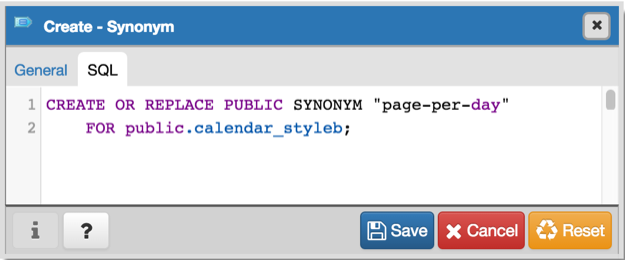

.. _synonym:

******************
The Synonym Dialog
******************

Use the *Synonym* dialog to substitute the name of a target object with a user-defined synonym.

The *Synonym* dialog organizes the development of a synonym through the *General* tab. The *SQL* tab displays the SQL code generated by dialog selections. 

.. image:: images/synonym_general.png

Use the fields in the *General* tab to identify the synonym:

* Use the *Name* field to specify the alternate name for the target object. The name will be displayed in the *pgAdmin* tree control.
* Use the drop-down listbox next to *Owner* to select a role.
* Select the name of the local schema in which the synonym will reside from the drop-down listbox in the *Schema* field.

In the definition panel, identify the target:

* Use the drop-down listbox next to *Target Type* to select the the type of object the synonym references.
* Use the drop-down listbox next to *Target Schema* to select the name of the target schema.
* Use the drop-down listbox next to *Target Object* to select the name of the target object.

Click the *SQL* tab to continue.

Your entries in the *Synonym* dialog generate a SQL command (see an example below). Use the *SQL* tab for review; revisit the *General* tab to make any changes to the SQL command. 

**Example**

The following is an example of the sql command generated by user selections in the *Synonym* dialog: 

The example shown demonstrates creating a synonym that replaces *calendar_styleb* with *page-per-day*.

* The *Info* button (i) is disabled for this dialog.
* Click the *Save* button to save work.
* Click the *Cancel* button to exit without saving work.
* Click the *Reset* button to restore configuration parameters.

