.. _table_dialog:

*********************
`Table Dialog`:index:
*********************

Use the *Table* dialog to create or modify a table.

The *Table* dialog organizes the development of a table through the following
dialog tabs: *General*, *Columns*, *Constraints*, *Advanced*, *Parition*, *Parameter*, and
*Security*. The *SQL* tab displays the SQL code generated by dialog selections.

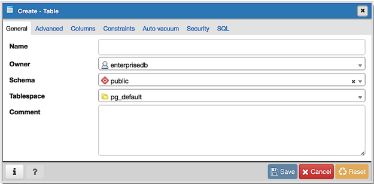

Use the fields in the *General* tab to identify the table:

* Use the *Name* field to add a descriptive name for the table. A table cannot
  have the same name as any existing table, sequence, index, view, foreign
  table, or data type in the same schema. The name specified will be displayed
  in the *pgAdmin* tree control. This field is required.
* Select the owner of the table from the drop-down listbox in the *Owner* field.
  By default, the owner of the table is the role that creates the table.
* Select the name of the schema in which the table will reside from the
  drop-down listbox in the *Schema* field.
* Use the drop-down listbox in the *Tablespace* field to specify the tablespace
  in which the table will be stored.
* Move the *Partitioned Table?* switch to the *Yes* in case you want to create a
  partitioned table. Option is available for PostgreSQL 10 and above.
* Store notes about the table in the *Comment* field.

Click the *Columns* tab to continue.

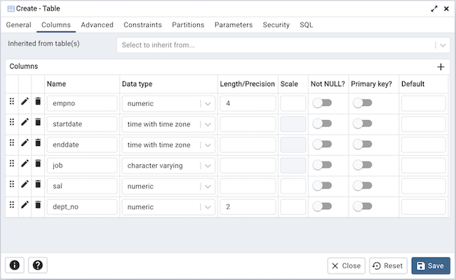

Use the drop-down listbox next to *Inherited from table(s)* to specify any
parent table(s); the table will inherit columns from the selected parent
table(s). Click inside the *Inherited from table(s)* field to select a table
name from a drop-down list. Repeat to add any other parent tables. Delete a
selected table by clicking the *x* to the left of the parent name. Note that
inherited column names and datatypes are not editable in the current dialog;
they must be modified at the parent level.

Click the *Add* icon (+) to specify the names of columns and their datatypes in
the *Columns* table:

* Use the *Name* field to add a descriptive name for the column.
* Use the drop-down listbox in the *Data type* field to select a data type for
  the column. This can include array specifiers. For more information on the
  data types supported by PostgreSQL, refer to Chapter 8 of the core
  documentation.
* If enabled, use the *Length/Precision* and *Scale* fields to specify the
  maximum number of significant digits in a numeric value, or the maximum
  number of characters in a text value.
* Move the *Not NULL?* switch to the *Yes* position to require a value in the
  column field.
* Move the *Primary key?* switch to the *Yes* position to specify the column is
  the primary key constraint.

Click the *Add* icon (+) to add additional columns; to discard a column, click
the trash icon to the left of the row and confirm deletion in the *Delete Row*
popup.

Click the *Constraints* tab to continue.

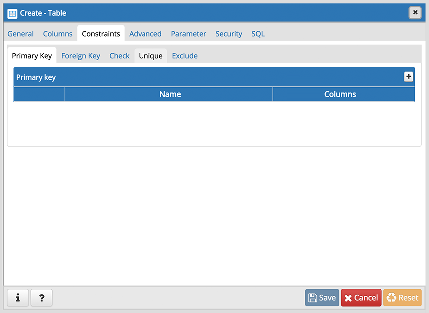

Use the fields in the *Constraints* tab to provide a table or column constraint.
Optional constraint clauses specify constraints (tests) that new or updated rows
must satisfy for an *INSERT* or *UPDATE* operation to succeed. Select the
appropriate constraint type by selecting one of the following tabs on the
*Constraints* panel:

.. table::
   :class: longtable
   :widths: 1 4

   +----------------+---------------------------------------------------------------------------------------------------------------------+
   | Tab Name       | Constraint                                                                                                          |
   +================+=====================================================================================================================+
   | *Primary Key*  | Provides a unique identifier for each row in the table.                                                             |
   +----------------+---------------------------------------------------------------------------------------------------------------------+
   | *Foreign Key*  | Maintains referential integrity between two tables.                                                                 |
   +----------------+---------------------------------------------------------------------------------------------------------------------+
   | *Check*        | Requires data satisfies an expression or condition before insertion or modification.                                |
   +----------------+---------------------------------------------------------------------------------------------------------------------+
   | *Unique*       | Ensures that the data contained in a column, or a group of columns, is unique among all the rows in the table.      |
   +----------------+---------------------------------------------------------------------------------------------------------------------+
   | *Exclude*      | Guarantees that if any two rows are compared on the specified column or expression (using the specified operator),  |
   |                | at least one of the operator comparisons will return false or null.                                                 |
   +----------------+---------------------------------------------------------------------------------------------------------------------+

To add a primary key for the table, select the *Primary Key* tab, and click the
*Add* icon (+). To define the primary key, click the *Edit* icon to the left of
the *Trash* icon. A dialog similar to the *Primary key* dialog (accessed by
right clicking on *Constraints* in the *pgAdmin* tree control)  opens.

Use the fields in the *General* tab to identify the primary key:

* Use the *Name* field to add a descriptive name for the primary key constraint.
  The name will be displayed in the *pgAdmin* tree control.
* Provide notes about the primary key in the *Comment* field.

Click the *Definition* tab to continue.

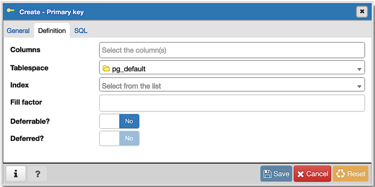

Use the fields in the *Definition* tab to define the primary key constraint:

* Click inside the *Columns* field and select one or more column names from the
  drop-down listbox. To delete a selection, click the *x* to the left of the
  column name. The primary key constraint should be different from any unique
  constraint defined for the same table; the selected column(s) for the
  constraints must be distinct.
* Select the name of the tablespace in which the primary key constraint will
  reside from the drop-down listbox in the *Tablespace* field.
* Use the *Fill Factor* field to specify a fill factor for the table and index.
  The fill factor for a table is a percentage between 10 and 100. 100 (complete
  packing) is the default.
* Move the *Deferrable?* switch to the *Yes* position to specify the timing of
  the constraint is deferrable and can be postponed until the end of the
  statement. The default is *No*.
* If enabled, move the *Deferred?* switch to the *Yes* position to specify the
  timing of the constraint is deferred to the end of the statement. The default
  is *No*.

To add a foreign key constraint, select the *Foreign Key* tab, and click the
*Add* icon (+). To define the constraint, click the *Edit* icon to the left of
the *Trash* icon. A dialog similar to the *Foreign key* dialog (accessed by
right clicking on *Constraints* in the *pgAdmin* tree control) opens.

Use the fields in the *General* tab to identify the foreign key constraint:

* Use the *Name* field to add a descriptive name for the foreign key constraint.
  The name will be displayed in the *pgAdmin* tree control.
* Provide notes about the foreign key in the *Comment* field.

Click the *Definition* tab to continue.

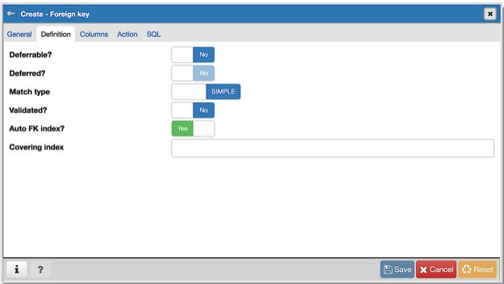

Use the fields in the *Definition* tab to define the foreign key constraint:

* Move the *Deferrable?* switch to the *Yes* position to specify the timing of
  the constraint is deferrable and can be postponed until the end of the
  statement. The default is *No*.
* If enabled, move the *Deferred?* switch to the *Yes* position to specify the
  timing of the constraint is deferred to the end of the statement. The default
  is *No*.
* Move the *Match type* switch specify the type of matching that is enforced by
  the constraint:

    * Select *Full* to indicate that all columns of a multicolumn foreign key
      must be null if any column is null; if all columns are null, the row is
      not required to have a match in the referenced table.
    * Select *Simple* to specify that a single foreign key column may be null;
      if any column is null, the row is not required to have a match in the
      referenced table.

* Move the *Validated* switch to the *Yes* position to instruct the server to
  validate the existing table content (against a foreign key or check
  constraint) when you save modifications to this dialog.
* Move the *Auto FK Index* switch to the *No* position to disable the automatic
  index feature.
* The field next to *Covering Index* generates the name of an index if the *Auto
  FK Index* switch is in the *Yes* position; or, this field is disabled.

Click the *Columns* tab to continue.

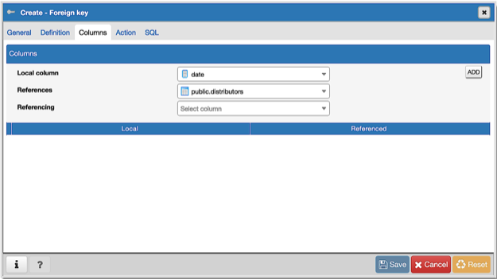

Use the fields in the *Columns* tab to specify one or more reference column(s).
 A Foreign Key constraint requires that one or more columns of a table must only
 contain values that match values in the referenced column(s) of a row of a
 referenced table:

* Use the drop-down listbox next to *Local column* to specify the column in the
  current table that will be compared to the foreign table.
* Use the drop-down listbox next to *References* to specify the name of the
  table in which the comparison column(s) resides.
* Use the drop-down listbox next to *Referencing* to specify a column in the
  foreign table.

Click the *Add* icon (+) to add a column to the list; repeat the steps above and
click the *Add* icon (+) to add additional columns. To discard an entry, click
the trash icon to the left of the entry and confirm deletion in the *Delete Row*
popup.

Click the *Action* tab to continue.

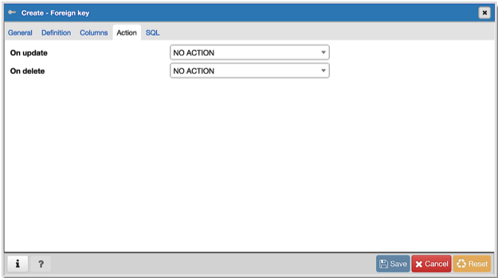

Use the drop-down listboxes on the *Action* tab to specify behavior related to
the foreign key constraint that will be performed when data within the table is
updated or deleted:

* Use the drop-down listbox next to *On update* to select an action that will be
  performed when data in the table is updated.
* Use the drop-down listbox next to *On delete* to select an action that will be
  performed when data in the table is deleted.

The supported actions are:

.. table::
   :class: longtable
   :widths: 1 4

   +-------------+------------------------------------------------------------------------------------------------------------+
   | NO ACTION   | Produce an error indicating that the deletion or update will create a foreign key constraint violation.    |
   |             | If the constraint is deferred, this error will be produced at constraint check time if any referencing     |
   |             | rows still exist.  This is the default.                                                                    |
   +-------------+------------------------------------------------------------------------------------------------------------+
   | RESTRICT    | Throw an error indicating that the deletion or update would create a foreign key constraint violation.     |
   |             | This is the same as NO ACTION except that the check is not deferrable.                                     |
   +-------------+------------------------------------------------------------------------------------------------------------+
   | CASCADE     | Delete any rows referencing the deleted row, or update the values of the referencing column(s) to the new  |
   |             | values of the referenced columns, respectively.                                                            |
   +-------------+------------------------------------------------------------------------------------------------------------+
   | SET NULL    | Set the referencing column(s) to null.                                                                     |
   +-------------+------------------------------------------------------------------------------------------------------------+
   | SET DEFAULT | Set the referencing column(s) to their default values.  There must be a row in the referenced table        |
   |             | that matches the default values (if they are not null), or the operation will fail.                        |
   +-------------+------------------------------------------------------------------------------------------------------------+

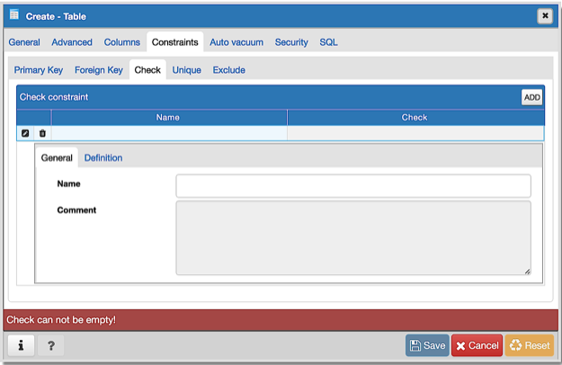

To add a check constraint, select the *Check* tab on the panel, and click the
*Add* icon (+). To define the check constraint, click the *Edit* icon to the
left of the *Trash* icon. A dialog similar to the *Check* dialog (accessed by
right clicking on *Constraints* in the *pgAdmin* tree control) opens.

Use the fields in the *General* tab to identify the check constraint:

* Use the *Name* field to add a descriptive name for the check constraint. The
  name will be displayed in the *pgAdmin* tree control. With PostgreSQL 9.5
  forward, when a table has multiple check constraints, they will be tested for
  each row in alphabetical order by name and after NOT NULL constraints.
* Provide notes about the check constraint in the *Comment* field.

Click the *Definition* tab to continue.

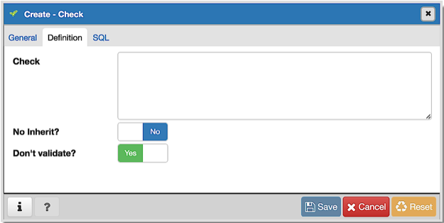

Use the fields in the *Definition* tab to define the check constraint:

* Provide the expression that a row must satisfy in the *Check* field. This
  field is required.
* Move the *No Inherit?* switch to the *Yes* position to specify that this
  constraint is not automatically inherited by a table's children. The default
  is *No*, meaning that the constraint will be inherited by any children.
* Move the *Don't validate?* switch to the *No* position to skip validation of
  existing data; the constraint may not hold for all rows in the table. The
  default is *Yes*.

.. image:: images/table_unique.png
    :alt: Table dialog unique constraint
    :align: center

To add a unique constraint, select the *Unique* tab on the panel, and click the
*Add* icon (+). To define the constraint, click the *Edit* icon to the left of
the *Trash* icon. A dialog similar to the *Unique constraint* dialog (accessed
by right clicking on *Constraints* in the *pgAdmin* tree control) opens.

Use the fields in the *General* tab to identify the unique constraint:

* Use the *Name* field to add a descriptive name for the unique constraint. The
  name will be displayed in the *pgAdmin* tree control.
* Provide notes about the unique constraint in the *Comment* field.

Click the *Definition* tab to continue.

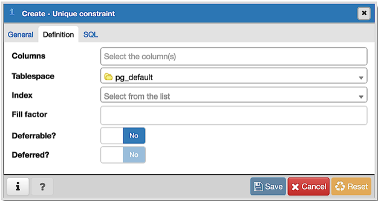

Use the fields in the *Definition* tab to define the unique constraint:

* Click inside the *Columns* field and select one or more column names from the
  drop-down listbox. To delete a selection, click the *x* to the left of the
  column name. The unique constraint should be different from the primary key
  constraint defined for the same table; the selected column(s) for the
  constraints must be distinct.
* Select the name of the tablespace in which the unique constraint will reside
  from the drop-down listbox in the *Tablespace* field.
* Use the *Fill Factor* field to specify a fill factor for the table and index.
  The fill factor for a table is a percentage between 10 and 100. 100 (complete
  packing) is the default.
* Move the *Deferrable?* switch to the *Yes* position to specify the timing of
  the constraint is deferrable and can be postponed until the end of the
  statement. The default is *No*.
* If enabled, move the *Deferred?* switch to the *Yes* position to specify the
  timing of the constraint is deferred to the end of the statement. The default
  is *No*.

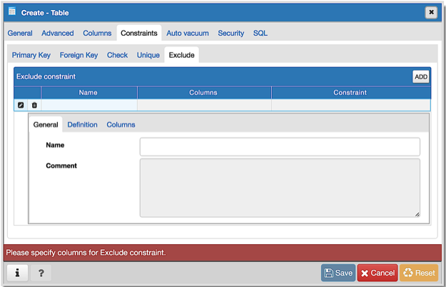

To add an exclusion constraint, select the *Exclude* tab on the panel, and click
the *Add* icon (+). To define the constraint, click the *Edit* icon to the left
of the *Trash* icon. A dialog similar to the *Exclusion constraint* dialog
(accessed by right clicking on *Constraints* in the *pgAdmin* tree control)
opens.

Use the fields in the *General* tab to identify the exclusion constraint:

* Use the *Name* field to provide a descriptive name for the exclusion
  constraint. The name will be displayed in the *pgAdmin* tree control.
* Provide notes about the exclusion constraint in the *Comment* field.

Click the *Definition* tab to continue.

.. image:: images/exclusion_constraint_definition.png
    :alt: Table dialog exclusion constraint definition
    :align: center

Use the fields in the *Definition* tab to define the exclusion constraint:

* Use the drop-down listbox next to *Tablespace* to select the tablespace in
  which the index associated with the exclude constraint will reside.
* Use the drop-down listbox next to *Access method* to specify the type of
  index that will be used when implementing the exclusion constraint:

    * Select *gist* to specify a GiST index (the default).
    * Select *spgist* to specify a space-partitioned GiST index.
    * Select *btree* to specify a B-tree index.
    * Select *hash* to specify a hash index.

* Use the *Fill Factor* field to specify a fill factor for the table and
  associated index. The fill factor is a percentage between 10 and 100. 100
  (complete packing) is the default.
* Move the *Deferrable?* switch to the *Yes* position to specify that the timing
  of the constraint is deferrable, and can be postponed until the end of the
  statement. The default is *No*.
* If enabled, move the *Deferred?* switch to the *Yes* position to specify the
  timing of the constraint is deferred to the end of the statement. The default
  is *No*.
* Use the *Constraint* field to provide a condition that a row must satisfy to
  be included in the table.

Click the *Columns* tab to continue.

.. image:: images/exclusion_constraint_columns.png
    :alt: Table dialog exclusion constraint columns
    :align: center

Use the fields in the *Columns* tab to specify the column(s) to which the
constraint applies. Use the drop-down listbox next to *Column* to select a
column and click the *Add* icon (+) to provide details of the action on the
column:

* The *Column* field is populated with the selection made in the *Column*
  drop-down listbox.
* If applicable, use the drop-down listbox in the *Operator class* to specify
  the operator class that will be used by the index for the column.
* Move the *DESC* switch to *DESC* to specify a descending sort order. The
  default is *ASC* which specifies an ascending sort order.
* Move the *NULLs order* switch to *LAST* to define an ascending sort order for
  NULLs. The default is *FIRST* which specifies a descending order.
* Use the drop-down list next to *Operator* to specify a comparison or
  conditional operator.

Click the *Advanced* tab to continue.

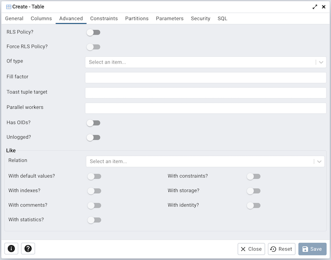

Use the fields in the *Advanced* tab to define advanced features for the table:

* Move the *RLS Policy?* switch to the *Yes* position to enable the Row Level Security.
* Move the *Force RLS Policy?* to the *Yes* position to force the policy on the owner of the table.
* Use the drop-down listbox next to *Of type* to copy the table structure from
  the specified composite type. Please note that a typed table will be dropped
  if the type is dropped (with DROP TYPE ... CASCADE).
* Use the *Fill Factor* field to specify a fill factor for the table. The fill
  factor for a table is a percentage between 10 and 100. 100 (complete packing)
  is the default.
* Use the *Toast tuple target* field to set toast_tuple_target storage
  parameter of the table. The toast_tuple_target value is in bytes and has
  minimum value of 128. This field will be enabled only for
  PostgreSQL version >= 11
* Use the *Parallel workers* field to set parallel_workers storage
  parameter of the table. The parallel_workers sets the number of workers that
  should be used to assist a parallel scan of the table. This field will be
  enabled only for PostgreSQL version >= 9.6
* Move the *Has OIDs?* switch to the *Yes* position to specify that each row
  within a table has a system-assigned object identifier. The default is *No*.
* Move the *Unlogged?* switch to the *Yes* position to disable logging for the
  table. Data written to an unlogged table is not written to the write-ahead
  log. Any indexes created on an unlogged table are automatically unlogged as
  well. The default is *No*.

Use the fields in the **Like** box to specify which attributes of an existing
table from which a table will automatically copy column names, data types, and
not-null constraints;  after saving the new or modified table, any changes to
the original table will not be applied to the new table.

* Use the drop-down listbox next to *Relation* to select a reference table.
* Move the *With default values?* switch to the *Yes* position to copy default
  values.
* Move the *With constraints?* switch to the *Yes* position to copy table and
  column constraints.
* Move the *With indexes?* switch to the *Yes* position to copy indexes.
* Move the *With storage?* switch to the *Yes* position to copy storage settings.
* Move the *With comments?* switch to the *Yes* position to copy comments.

With PostgreSQL 10 forward, the *Partition* tab will be visible.

Click the *Partition* tab to continue.

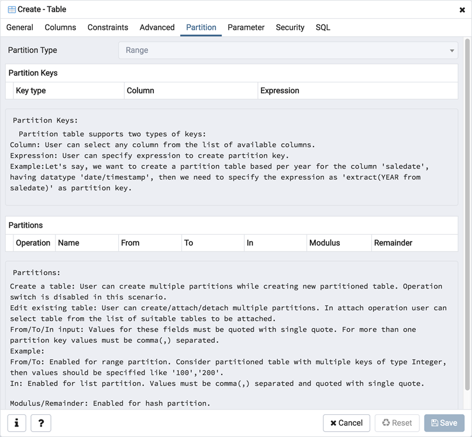

Use the fields in the *partition* tab to create the partitions for the table:

* Select a partition type from the *Partition Type* selection box. There are 3
  options available; Range, List and Hash. Hash option will only enable for
  PostgreSQL version >= 11.

Use the *Partition Keys* panel to define the partition keys. Click the *Add*
icon (+) to add each partition keys selection:

* Select a partition key type in the *Keytype* field.
* Select a partition column in the *Column* field if Column option selected for
  *Keytype* field .
* Specify the expression in the *Expression* field if Expression option selected
  for the *Keytype* field.

Use the *Partitions* panel to define the partitions of a table. Click the *Add*
icon (+) to add each partition:

* Move the *Operation* switch to *attach* to attach the partition, by default it
  is *create*.
* Use the *Name* field to add the name of the partition.
* If partition type is Range or List then *Default* field will be enabled.
* If partition type is Range then *From* and *To* fields will be enabled.
* If partition type is List then *In* field will be enabled.
* If partition type is Hash then *Modulus* and *Remainder* fields will be
  enabled.

Users can create a partition and define them as a partitioned table. Click
the *Edit* icon to expand the properties of a partition.
Use the *Partition* tab to create that partition as a partitioned table.

* Move the *Partitioned Table?* switch to the *Yes* in case you want to create a
  partitioned table.
* Select a partition type from the *Partition Type* selection box.
* Use the *Partition Keys* panel to define the partition keys.

View of multi level Partitioned Table in browser tree:

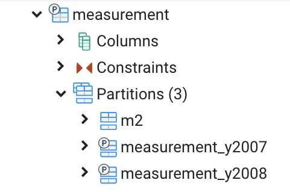

Click the *Parameter* tab to continue.

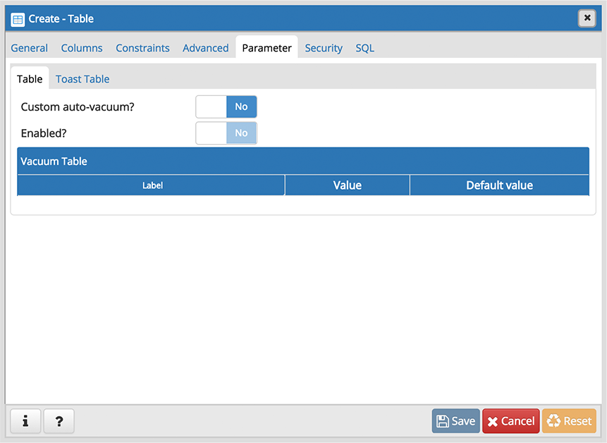

Use the tabs nested inside the *Parameter* tab to specify VACUUM and ANALYZE
thresholds; use the *Table* tab and the *Toast Table* tab to customize values
for the table and the associated toast table:

* Move the *Custom auto-vacuum?* switch to the *Yes* position to perform custom
  maintenance on the table and to select values in the
  *Vacuum table*. The *Vacuum Table* provides default values for maintenance
  operations.
* Changing *Autovacuum enabled?* to *Not set* will reset autovacuum_enabled.

Provide a custom value in the *Value* column for each metric listed in the
*Label* column.

Click the *Security* tab to continue.

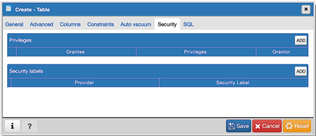

Use the *Security* tab to assign privileges and define security labels.

Use the *Privileges* panel to assign privileges to a role. Click the *Add* icon
(+) to set privileges for database objects:

* Select the name of the role from the drop-down listbox in the *Grantee* field.
* Click inside the *Privileges* field. Check the boxes to the left of one or
  more privileges to grant the selected privilege to the specified user.
* The current user, who is the default grantor for granting the privilege, is displayed in the *Grantor* field.

Click the *Add* icon (+) to assign additional privileges; to discard a
privilege, click the trash icon to the left of the row and confirm deletion in
the *Delete Row* popup.

Use the *Security Labels* panel to define security labels applied to the
function. Click the *Add* icon (+) to add each security label selection:

* Specify a security label provider in the *Provider* field. The named provider
  must be loaded and must consent to the proposed labeling operation.
* Specify a a security label in the *Security Label* field. The meaning of a
  given label is at the discretion of the label provider. PostgreSQL places no
  restrictions on whether or how a label provider must interpret security
  labels; it merely provides a mechanism for storing them.

Click the *Add* icon (+) to assign additional security labels; to discard a
security label, click the trash icon to the left of the row and confirm deletion
in the *Delete Row* popup.

Click the *SQL* tab to continue.

Your entries in the *Table* dialog generate a SQL command (see an example
below). Use the *SQL* tab for review; revisit or switch tabs to make any
changes to the SQL command.

Example
*******

The following is an example of the sql command generated by user selections in
the *Table* dialog:

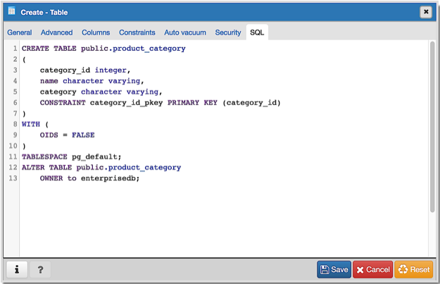

The example shown demonstrates creating a table named *jobhist*. It has
six columns and a primary key constraint on the *empno and startdate* column.

* Click the *Info* button (i) to access online help.
* Click the *Save* button to save work.
* Click the *Close* button to exit without saving work.
* Click the *Reset* button to restore configuration parameters.
