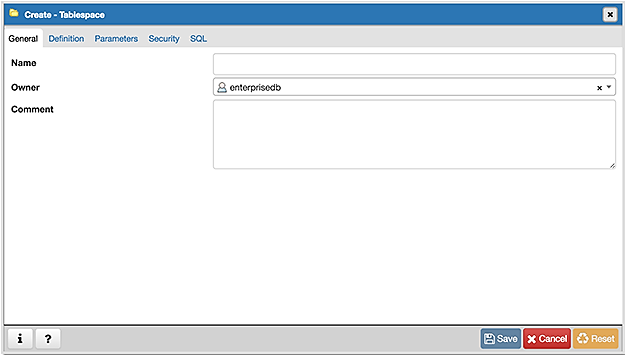
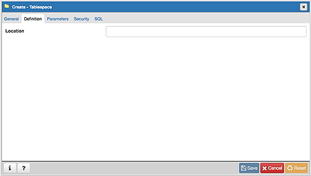
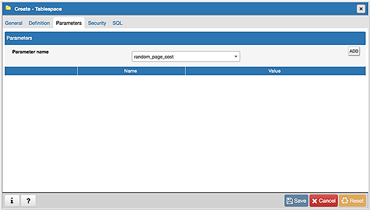
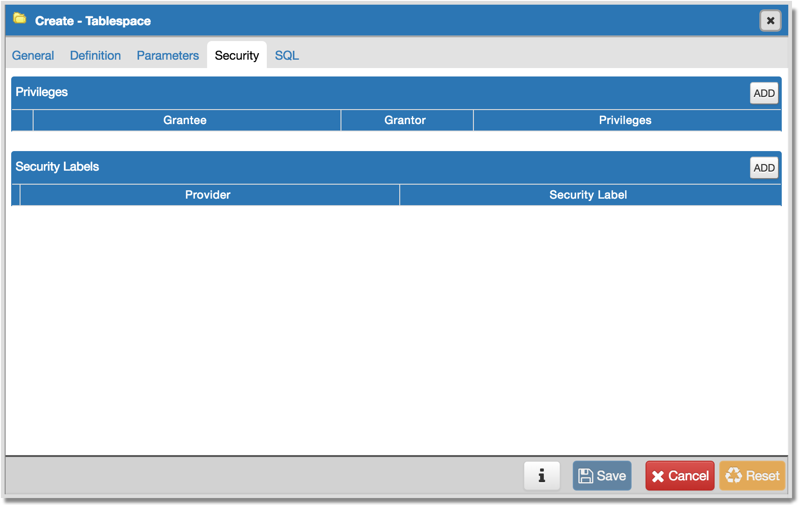
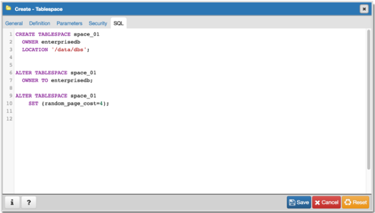

.. _tablespace_dialog:

**************************
`Tablespace Dialog`:index:
**************************

Use The *Tablespace* dialog to define a tablespace. A tablespace allows
superusers to define an alternative location on the file system where the data
files containing database objects (such as tables and indexes) reside.
Tablespaces are only supported on systems that support symbolic links. Note that
a tablespace cannot be used independently of the cluster in which it is defined.

The *Tablespace* dialog organizes the definition of a tablespace through the
following tabs: *General*, *Definition*, *Parameters*, and *Security*. The *SQL*
tab displays the SQL code generated by dialog selections.

* Use the *Name* field to identify the tablespace with a descriptive name. The
  name cannot begin with pg\_; these names are reserved for system tablespaces.
* Select the owner of the tablespace from the drop-down listbox in the *Owner*
  field.
* Store notes about the tablespace in the *Comment* field.

Click the *Definition* tab to continue.

* Use the *Location* field to specify an absolute path to a directory that will
  contain the tablespace.

Click the *Parameters* tab to continue.

Use the *Parameters* tab to set parameters for the tablespace. Click the *Add*
icon (+) to add a row to the table below.

* Use the drop-down listbox next to *Name* to select a parameter.
* Use the *Value* field to set a value for the parameter.

Click the *Add* icon (+) to specify each additional parameter; to discard a
parameter, click the trash icon to the left of the row and confirm deletion in
the *Delete Row* dialog.

Click the *Security* tab to continue.

Use the *Security* tab to assign privileges and define security labels for the
tablespace.

Use the *Privileges* panel to assign security privileges. Click the *Add* icon
(+) to assign a set of privileges:

* Select the name of the role from the drop-down listbox in the *Grantee* field.
* The current user, who is the default grantor for granting the privilege, is displayed in the *Grantor* field.
* Click inside the *Privileges* field. Check the boxes to the left of one or
  more privileges to grant the selected privileges to the specified user.

Click the *Add* icon to assign additional sets of privileges; to discard a
privilege, click the trash icon to the left of the row and confirm deletion in
the *Delete Row* popup.

Use the *Security Labels* panel to define security labels applied to the
tablespace. Click the *Add* icon (+) to add each security label selection:

* Specify a security label provider in the *Provider* field. The named provider
  must be loaded and must consent to the proposed labeling operation.
* Specify a a security label in the *Security Label* field. The meaning of a
  given label is at the discretion of the label provider. PostgreSQL places no
  restrictions on whether or how a label provider must interpret security
  labels; it merely provides a mechanism for storing them.

To discard a security label, click the trash icon to the left of the row and
confirm deletion in the *Delete Row* popup.

Click the *SQL* tab to continue.

Your entries in the *Tablespace* dialog generate a SQL command (see an example
below). Use the *SQL* tab for review; revisit or switch tabs to make any changes
to the SQL command.

Example
*******

The following is an example of the sql command generated by user selections in
the *Tablespace* dialog:

The example shown demonstrates creating a tablespace named *space_01*. It has a
*random_page_cost* value equal to *1*.

* Click the *Info* button (i) to access online help.
* Click the *Save* button to save work.
* Click the *Cancel* button to exit without saving work.
* Click the *Reset* button to restore configuration parameters.
