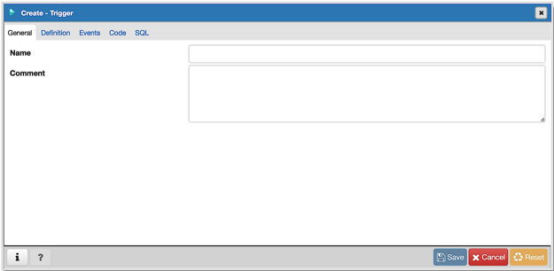
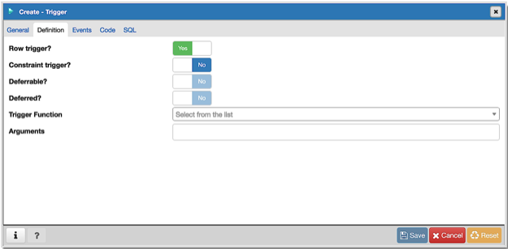
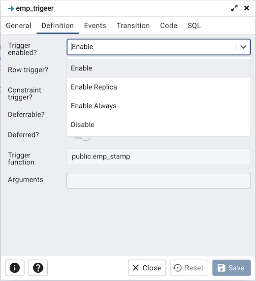
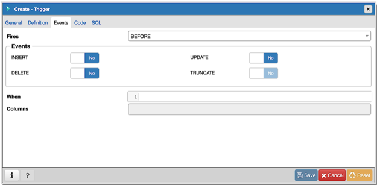
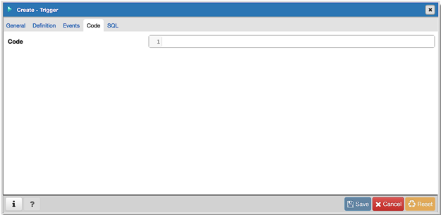
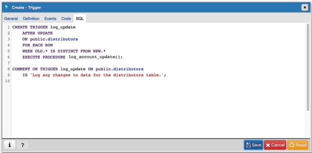

.. _trigger_dialog:

***********************
`Trigger Dialog`:index:
***********************

Use the *Trigger* dialog to create a trigger or modify an existing trigger.  A
trigger executes a specified function when certain events occur.

The *Trigger* dialog organizes the development of a trigger through the
following dialog tabs: *General*, *Definition*, *Events*, and *Code*. The *SQL*
tab displays the SQL code generated by dialog selections.

Use the fields in the *General* tab to identify the trigger:

* Use the *Name* field to add a descriptive name for the trigger. This must be
  distinct from the name of any other trigger for the same table. The name will
  be displayed in the *pgAdmin* tree control. Note that if multiple triggers of
  the same kind are defined for the same event, they will be fired in
  alphabetical order by name.
* Store notes about the trigger in the *Comment* field.

Click the *Definition* tab to continue.

Use the fields in the *Definition* tab to define the trigger:

* Move the *Row trigger?* switch to the *No* position to disassociate the
  trigger from firing on each row in a table. The default is *Yes*.
* Move the *Constraint trigger?* switch to the *Yes* position to specify the
  trigger is a constraint trigger.
* If enabled, move the *Deferrable?* switch to the *Yes* position to specify
  the timing of the constraint trigger is deferrable and can be postponed until
  the end of the statement. The default is *No*.
* If enabled, move the *Deferred?* switch to the *Yes* position to specify the
  timing of the constraint trigger is deferred to the end of the statement
  causing the triggering event. The default is *No*.
* Use the drop-down listbox next to *Trigger Function* to select a trigger
  function or procedure.
* Use the *Arguments* field to provide an optional (comma-separated) list of
  arguments to the function when the trigger is executed. The arguments are
  literal string constants.

* *Trigger enabled* field is available in trigger dialog once the trigger is created.
  You can select one of the four options available.

Click the *Events* tab to continue.

Use the fields in the *Events* tab to specify how and when the trigger fires:

* Use the drop-down listbox next to the *Fires* fields to determine if the
  trigger fires *BEFORE* or *AFTER* a specified event. The default is *BEFORE*.
* Select the type of event(s) that will invoke the trigger; to select an event
  type, move the switch next to the event to the *YES* position.  The supported
  event types are *INSERT*, *UPDATE*, *DELETE*, and *TRUNCATE*.
* Use the *When* field to provide a boolean condition that will invoke the
  trigger.
* If defining a column-specific trigger, use the *Columns* field to specify the
  columns or columns that are the target of the trigger.

Click the *Code* tab to continue.

Use the *Code* field to specify any additional code that will be invoked when
the trigger fires.

Click the *SQL* tab to continue.

Your entries in the *Trigger* dialog generate a SQL command (see an example
below). Use the *SQL* tab for review; revisit or switch tabs to make any changes
to the SQL command.

Example
*******

The following is an example of the sql command generated by user selections in
the *Trigger* dialog:

The example demonstrates creating a trigger named *log_update*.

* Click the *Info* button (i) to access online help.
* Click the *Save* button to save work.
* Click the *Cancel* button to exit without saving work.
* Click the *Reset* button to restore configuration parameters.
