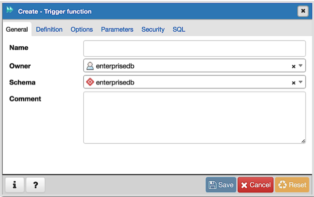
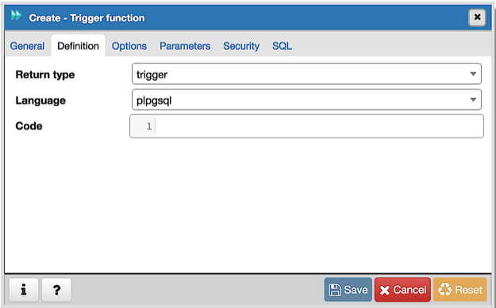
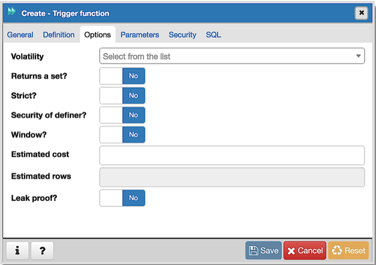
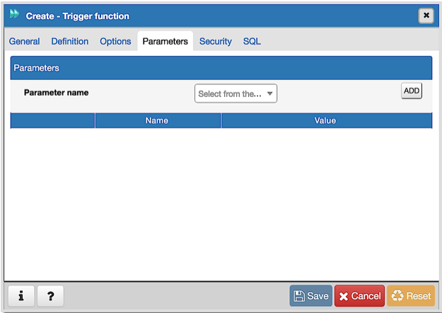
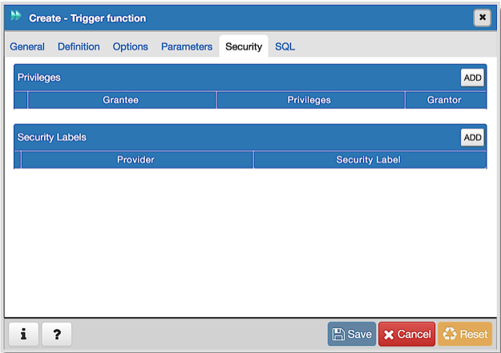
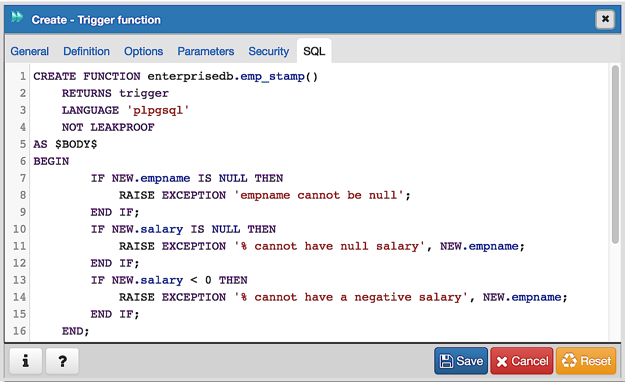

.. _trigger_function_dialog:

********************************
`Trigger function Dialog`:index:
********************************

Use the *Trigger function* dialog to create or manage a trigger_function. A trigger function defines the action that will be invoked when a trigger fires.

The *Trigger function* dialog organizes the development of a trigger function through the following dialog tabs: *General*, *Definition*, *Options*, *Parameters* and *Security*. The *SQL* tab displays the SQL code generated by dialog selections.

Use the fields in the *General* tab to identify the trigger function:

* Use the *Name* field to add a descriptive name for the trigger function. The name will be displayed in the *pgAdmin* tree control. Please note that trigger functions will be invoked in alphabetical order.
* Use the drop-down listbox next to *Owner* to select the role that will own the trigger function.
* Select the name of the schema in which the trigger function will reside from the drop-down listbox in the *Schema* field.
* Store notes about the trigger function in the *Comment* field.

Click the *Definition* tab to continue.

Use the fields in the *Definition* tab to define the trigger function:

* Use the drop-down listbox next to *Return type* to specify the pseudotype that is associated with the trigger function:

   * Select *trigger* if you are creating a DML trigger.
   * Select *event_trigger* if you are creating a DDL trigger.

* Use the drop-down listbox next to *Language* to select the implementation language. The default is *plpgsql*.
* Use the *Code* field to write the code that will execute when the trigger function is called.

Click the *Options* tab to continue.

Use the fields in the *Options* tab to describe or modify the action of the trigger function:

* Use the drop-down listbox next to *Volatility* to select one of the following:

    * *VOLATILE* indicates that the trigger function value can change even within a single table scan.
    * *STABLE* indicates that the trigger function cannot modify the database, and that within a single table scan it will consistently return the same result for the same argument values.
    * *IMMUTABLE* indicates that the trigger function cannot modify the database and always returns the same result when given the same argument values.

* Move the *Returns a Set?* switch to indicate if the trigger function returns a set that includes multiple rows. The default is *No*.
* Move the *Strict?* switch to indicate if the trigger function always returns NULL whenever any of its arguments are NULL. If *Yes*, the function is not executed when there are NULL arguments; instead a NULL result is assumed automatically. The default is *No*.
* Move the *Security of definer?* switch to specify that the trigger function is to be executed with the privileges of the user that created it. The default is *No*.
* Move the *Window?* switch to indicate that the trigger function is a window function rather than a plain function. The default is *No*. This is currently only useful for trigger functions written in C.
* Use the *Estimated cost* field to specify a positive number representing the estimated execution cost for the trigger function, in units of cpu_operator_cost. If the function returns a set, this is the cost per returned row.
* Use the *Estimated rows* field to specify a positive number giving the estimated number of rows that the query planner should expect the trigger function to return. This is only allowed when the function is declared to return a set. The default assumption is 1000 rows.
* Move the *Leak proof?* switch to indicate whether the trigger function has side effects. The default is *No*. This option can only be set by the superuser.

Click the *Parameters* tab to continue.

Use the fields in the *Parameters* tab to specify settings that will be applied when the trigger function is invoked. Click the *Add* icon (+) to add a *Name*/*Value* pair to the table below.

* Use the drop-down listbox in the *Name* field to select a parameter.
* Use the *Value* field to specify the value that will be associated with the selected parameter. This field is context-sensitive.

Click the *Add* icon (+) to set additional parameters; to discard a parameter, click the trash icon to the left of the row and confirm deletion in the *Delete Row* popup.

Click the *Security* tab to continue.

Use the *Security* tab to assign privileges and define security labels.

Use the *Privileges* panel to assign usage privileges for the trigger function to a role. Click the *Add* icon (+) to to add a role to the table.

* Select the name of the role from the drop-down listbox in the *Grantee* field.
* Click inside the *Privileges* field. Check the boxes to the left of one or more privileges to grant the selected privilege to the specified user.
* Select the name of a role from the drop-down listbox in the *Grantor* field. The default grantor is the owner of the database.

Click the *Add* icon (+) to assign additional privileges; to discard a privilege, click the trash icon to the left of the row and confirm deletion in the *Delete Row* popup.

Use the *Security Labels* panel to define security labels applied to the trigger function. Click the *Add* icon (+) to add each security label selection:

* Specify a security label provider in the *Provider* field. The named provider must be loaded and must consent to the proposed labeling operation.
* Specify a a security label in the *Security Label* field. The meaning of a given label is at the discretion of the label provider. PostgreSQL places no restrictions on whether or how a label provider must interpret security labels; it merely provides a mechanism for storing them.

Click the *Add* icon (+) to assign additional security labels; to discard a security label, click the trash icon to the left of the row and confirm deletion in the *Delete Row* popup.

Click the *SQL* tab to continue.

Your entries in the *Trigger function* dialog generate a SQL command (see an example below). Use the *SQL* tab for review; revisit other tabs to modify the SQL command.

**Example**

The following is an example of the sql command generated by user selections in the *Trigger function* dialog:

The example shown demonstrates creating a trigger function named *emp_stamp* that checks for a new employee's name, and checks that the employee's salary is a positive value.

* Click the *Info* button (i) to access online help. View context-sensitive help in the *Tabbed browser*, where a new tab displays the PostgreSQL core documentation.
* Click the *Save* button to save work.
* Click the *Cancel* button to exit without saving work.
* Click the *Reset* button to restore configuration parameters.

