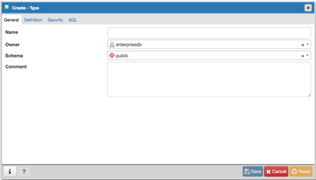
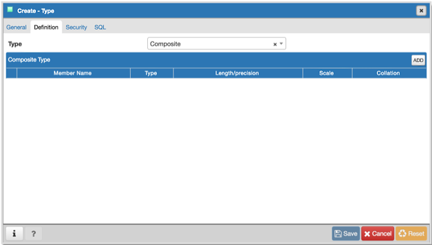
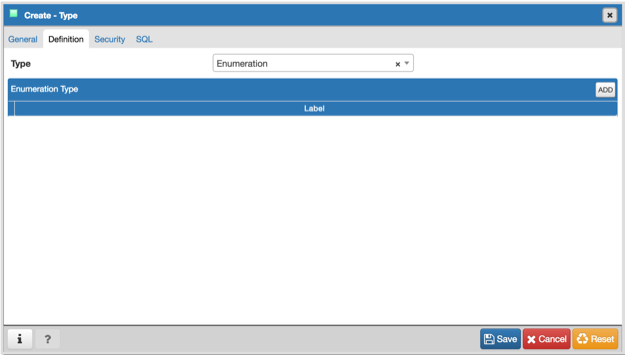
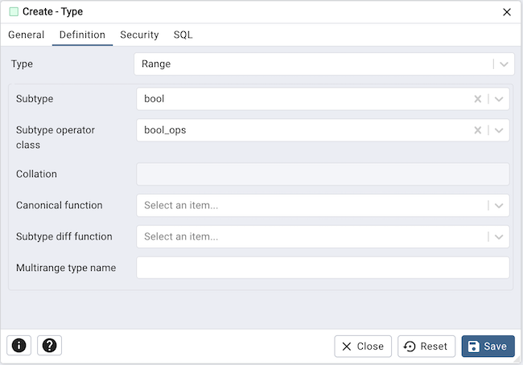
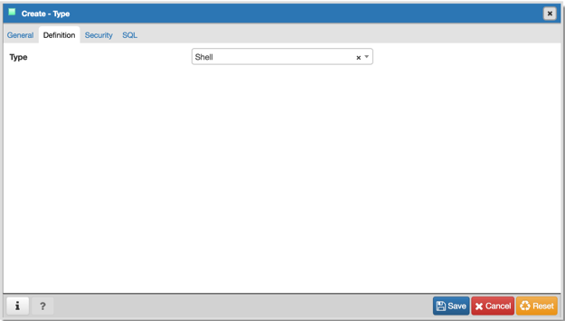
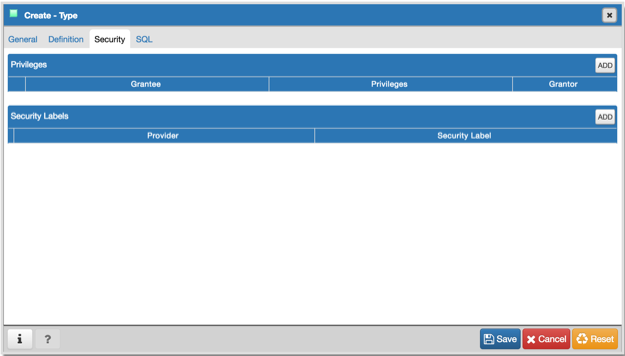

.. _type_dialog:

********************
`Type Dialog`:index:
********************

Use the *Type* dialog to register a custom data type.

The *Type* dialog organizes the development of a data type through the following
dialog tabs: *General*, *Definition*, and *Security*. The *SQL* tab displays the
SQL code generated by dialog selections.

Use the fields in the *General* tab to identify the custom data type:

* Use the *Name* field to add a descriptive name for the type. The name will be
  displayed in the *pgAdmin* tree control. The type name must be distinct from
  the name of any existing type, domain, or table in the same schema.
* Use the drop-down listbox next to *Owner* to select the role that will own the
  type.
* Select the name of the schema in which the type will reside from the drop-down
  listbox in the *Schema* field.
* Store notes about the type in the *Comments* field.

Click the *Definition* tab to continue.

Select a data type from the drop-down listbox next to *Type* on the *Definition*
tab; the panel below changes to display the options appropriate for the selected
data type. Use the fields in the panel to define the data type.

There are five data types:

 * *Composite Type*
 * *Enumeration Type*
 * *Range Type*
 * *External Type* (or *Base Type*)
 * *Shell Type*

If you select *Composite* in the *Type* field, the *Definition* tab displays the
*Composite Type* panel:

Click the *Add* icon (+) to provide attributes of the type. Fields on the
*General* panel are context sensitive and may be disabled.

* Use the *Member Name* field to add an attribute name.
* Use the drop-down listbox in the *Type* field to select a datatype.
* Use the *Length/Precision* field to specify the maximum length of a
  non-numeric type, or the total count of significant digits in a numeric type.
* Use the *Scale* field to specify the number of digits to the right of the
  decimal point.
* Use the drop-down listbox in the *Collation* field to select a collation (if
  applicable).

Click the *Add* icon (+) to define an additional member; click the trash icon to
the left of the row to discard a row.

If you select the *Enumeration* in the *Type* field, the *Definition* tab
displays the *Enumeration Type* panel:

Click the *Add* icon (+) to provide a label for the type.

* Use the *Label* field to add a label, which must be less than 64 bytes long.

Click the *Add* icon (+) after each selection to create additional labels; to
discard a label, click the trash icon to the left of the row.

If you select *External*, the *Definition* tab displays the *External Type*
panel:

.. image:: images/type_external.png
    :alt: Type dialog external section
    :align: center

On the *Required* tab:

* Use the drop-down listbox next to the *Input function* field to add an
  input_function. The input_function converts the type's external textual
  representation to the internal representation used by the operators and
  functions defined for the type.
* Use the drop-down listbox next to the *Output function* field to add an
  output_function. The output_function converts the type's internal
  representation used by the operators and functions defined for the type to
  the type's external textual representation.

On the *Optional-1* tab:

* Use the drop-down listbox next to the optional *Receive Function* field to
  select a receive_function. The optional receive_function converts the type's
  external binary representation to the internal representation. If this
  function is not supplied, the type cannot participate in binary input.
* Use the drop-down listbox next to the optional *Send function* field to
  select a send_function. The optional send_function converts from the internal
  representation to the external binary representation. If this function is not
  supplied, the type cannot participate in binary output.
* Use the drop-down listbox next to the optional *Typmod in function* field tab
  to select a type_modifier_input_function.
* Use the drop-down listbox next to the optional *Typmod out function* field tab
  to select a type_modifier_output_function. It is allowed to omit the
  type_modifier_output_function, in which case the default display format is the
  stored typmod integer value enclosed in parentheses.
* Use the optional *Internal length* to specify a value for internal
  representation.
* Move the *Variable?* switch to specify the internal representation is of
  variable length (VARIABLE). The default is a fixed length positive integer.
* Specify a default value in the optional *Default* field in cases where a
  column of the data type defaults to something other than the null value.
  Specify the default with the DEFAULT key word. (A default can be overridden
  by an explicit DEFAULT clause attached to a particular column.)
* Use the drop-down listbox next to the optional *Analyze function* field to
  select a function for performing type-specific statistics collection for
  columns of the data type.
* Use the drop-down listbox next to the optional *Category type* field to help
  control which implicit cast will be applied in ambiguous situations.
* Move the *Preferred?* switch to *Yes* to specify the selected category type is
  preferred. The default is *No*.

On the *Optional-2* tab:

* Use the drop-down listbox next to the optional *Element type* field to specify
  a data type.
* Use the optional *Delimiter* field to indicate the delimiter to be used
  between values in the external representation of arrays for this data type.
  The default delimiter is the comma (,). Note that the delimiter is associated
  with the array element type, not the array type itself.
* Use the drop-down listbox next to *Alignment type* to specify the storage
  alignment required for the data type.  The allowed values (char, int2, int4,
  and double) correspond with alignment on 1, 2, 4, or 8 byte boundaries.
* Use the drop-down listbox next to optional *Storage type* to select a strategy
  for storing data.
* Move the *Passed by value?* switch to *Yes* to override the existing data type
  value. The default is *No*.
* Move the *Collatable?* switch to *Yes* to specify column definitions and
  expressions of the type may carry collation information through use of the
  COLLATE clause. The default is *No*.

If you select *Range* in the *Type* field, the *Definition* tab displays the
*Range* panel. Fields on the *Range* panel are context-sensitive and may be
disabled.

* Use the drop-down listbox next to *Sub-type* to select an associated b-tree
  operator class (to determine the ordering of values for the range type).
* Use the drop-down listbox next to *Sub-type operator class* to use a
  non-default operator class.
* Use the drop-down listbox next to *Collation* to use a non-default collation
  in the range's ordering if the sub-type is collatable.
* Use the drop-down listbox next to *Canonical function* to convert range
  values to a canonical form.
* Use the drop-down listbox next to *Sub-type diff function* to select a
  user-defined subtype_diff function.

If you select *Shell* in the *Type* field, the *Definition* tab displays the
*Shell* panel:

A shell type is a placeholder for a type and has no parameters.

Click the *Security* tab to continue.

Use the *Security* tab to assign privileges and define security labels.

Use the *Privileges* panel to assign privileges for the type; click the *Add*
icon (+) to grant privileges:

* Select the name of the role that will be granted privileges on the type from
  the drop-down listbox in the *Grantee* field.
* Click inside the *Privileges* field. Check the boxes to the left of one or
  more privileges to grant the selected privilege to the specified user.
* The current user, who is the default grantor for granting the privilege, is displayed in the *Grantor* field.

Click the *Add* icon (+) to assign additional privileges; to discard a
privilege, click the trash icon to the left of the row and confirm deletion in
the *Delete Row* popup.

Use the *Security Labels* panel to define security labels applied to the type.
Click the *Add* icon (+) to add each security label selection:

* Specify a security label provider in the *Provider* field. The named provider
  must be loaded and must consent to the proposed labeling operation.
* Specify a security label in the *Security Label* field. The meaning of a given
  label is at the discretion of the label provider. PostgreSQL places no
  restrictions on whether or how a label provider must interpret security
  labels; it merely provides a mechanism for storing them.

Click the *Add* icon (+) to assign additional security labels; to discard a
security label, click the trash icon to the left of the row and confirm deletion
in the *Delete Row* popup.

Click the *SQL* tab to continue.

Your entries in the *Type* dialog generate a SQL command (see an example below).
Use the *SQL* tab for review; revisit or switch tabs to make any changes to the
SQL command.

Example
*******

The following is an example of a sql command generated by user selections made
in the *Type* dialog:

.. image:: images/type_sql.png
    :alt: Type dialog sql tab
    :align: center

The example shown demonstrates creating a data type named *work_order*. The data
type is an enumerated type with three labels: new, open and closed.

* Click the *Info* button (i) to access online help.
* Click the *Save* button to save work.
* Click the *Close* button to exit without saving work.
* Click the *Reset* button to restore configuration parameters.
