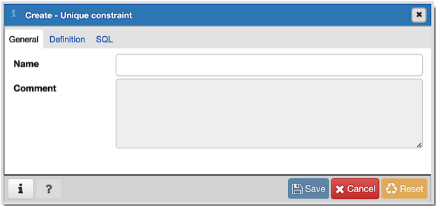
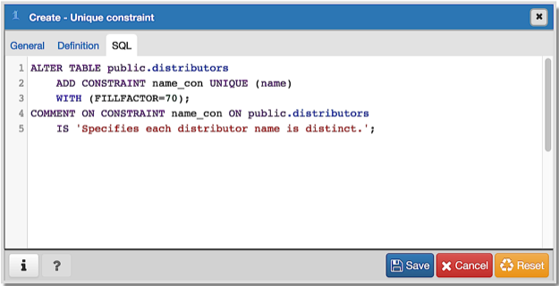

.. _unique_constraint_dialog:

*********************************
`Unique Constraint Dialog`:index:
*********************************

Use the *Unique constraint* dialog to define a unique constraint for a specified
table. Unique constraints ensure that the data contained in a column, or a group
of columns, is unique among all the rows in the table.

The *Unique constraint* dialog organizes the development of a unique constraint
through the following dialog tabs: *General* and *Definition*. The *SQL* tab
displays the SQL code generated by dialog selections.

Use the fields in the *General* tab to identify the unique constraint:

* Use the *Name* field to add a descriptive name for the unique constraint.
  The name will be displayed in the *pgAdmin* tree control.

Click the *Definition* tab to continue.

.. image:: images/unique_constraint_definition.png
    :alt: Unique Constraint dialog definition tab
    :align: center

Use the fields in the *Definition* tab to define the unique constraint:

* Click inside the *Columns* field and select one or more column names from the
  drop-down listbox. To delete a selection, click the *x* to the left of the
  column name. The unique constraint should be different from the primary key
  constraint defined for the same table; the selected column(s) for the
  constraints must be distinct.
* Use *Include columns* field to specify columns for *INCLUDE* clause of the
  constraint. This option is available in Postgres 11 and later.
* Select the name of the tablespace in which the unique constraint will reside
  from the drop-down listbox in the *Tablespace* field.
* Select the name of an index from the drop-down listbox in the *Index* field.
  This field is optional. Adding a unique constraint will automatically create a
  unique B-tree index on the column or group of columns listed in the
  constraint, and will force the column(s) to be marked NOT NULL.
* Use the *Fill Factor* field to specify a fill factor for the table and index.
  The fill factor for a table is a percentage between 10 and 100. 100 (complete
  packing) is the default.
* Move the *Deferrable?* switch to the *Yes* position to specify the timing of
  the constraint is deferrable and can be postponed until the end of the
  statement. The default is *No*.
* If enabled, move the *Deferred?* switch to the *Yes* position to specify the
  timing of the constraint is deferred to the end of the statement. The default
  is *No*.

Click the *SQL* tab to continue.

Your entries in the *Unique constraint* dialog generate a SQL command (see an
example below). Use the *SQL* tab for review; revisit or switch tabs to make any
changes to the SQL command.

Example
*******

The following is an example of the sql command generated by user selections in
the *Unique constraint* dialog:

The example shown demonstrates creating a unique constraint named *jobhist_unique* on
the *empno* column of the *jobhist* table.

* Click the *Info* button (i) to access online help.
* Click the *Save* button to save work.
* Click the *Close* button to exit without saving work.
* Click the *Reset* button to restore configuration parameters.
