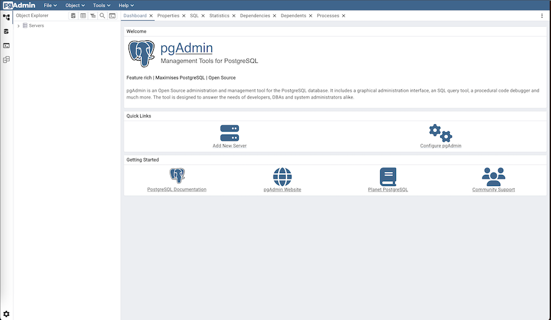

.. _user_interface:

***********************
`User Interface`:index:
***********************

pgAdmin 4 supports all PostgreSQL features, from writing simple SQL queries to
developing complex databases. It is designed to query an active database (in
real-time), allowing you to stay current with modifications and implementations.

Features of pgAdmin 4 include:

* auto-detection and support for objects discovered at run-time
* a live SQL Query Tool with direct data editing
* support for administrative queries
* a syntax-highlighting SQL editor
* redesigned graphical interfaces
* powerful management dialogs and tools for common tasks
* responsive, context-sensitive behavior
* supportive error messages
* helpful hints
* online help and information about using pgAdmin dialogs and tools.

When pgAdmin opens, the interface features a menu bar and a window divided into
two panes: the *Object Explorer* tree control in the left pane, and a tabbed browser in
the right pane.

Select an icon from the *Quick Links* panel on the *Dashboard* tab to:

* Click the *Add New Server* button to open the
  :ref:`Create - Server dialog <server_dialog>` to add a new server definition.
* Click the *Configure pgAdmin* button to open the
  :ref:`Preferences dialog <preferences>` to customize your pgAdmin client.

Links in the *Getting Started* panel open a new browser tab that provide useful
information for Postgres users:

* Click the *PostgreSQL Documentation* link to navigate to the *Documentation*
  page for the PostgreSQL open-source project; once at the project site, you
  can review the manuals for the currently supported versions of the PostgreSQL
  server.
* Click the *pgAdmin Website* link to navigate to the pgAdmin project website.
  The pgAdmin site features news about recent pgAdmin releases and other project
  information.
* Click the *Planet PostgreSQL* link to navigate to the blog aggregator for
  Postgres related blogs.
* Click the *Community Support* link to navigate to the *Community* page at the
  PostgreSQL open-source project site; this page provides information about
  obtaining support for PostgreSQL features.

