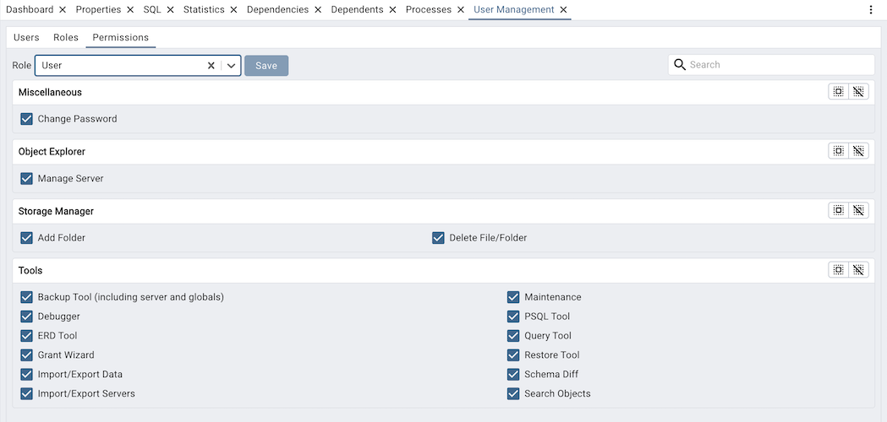

.. _user_management:

*******************************
`User Management`:index:
*******************************

When invoking pgAdmin in desktop mode, a password is randomly generated, and
then ignored. If you install pgAdmin in server mode, you will be prompted for
an administrator email and password for the pgAdmin client.

When you authenticate with pgAdmin, the server definitions associated with that
login role are made available in the tree control.

Users Tab
*********
An administrative user can use the *Users* tab to:

* manage pgAdmin users
* change users role
* change password for a user
* deactivate user
* unlock a locked user

Use the *Search* field to specify a criteria and review a list of users
that matches with the specified criteria. You can enter a value that matches
the following criteria types: *Authentication source*, *Username*, or *Email*.
For example, you can enter *ldap* in the search box and only the records having
*ldap* as authentication source will be displayed in the *User Management* table.

To add a user, click the Add (+) button at the top left corner. It will open a
dialog where you can fill in details for the new user.

Provide information about the new pgAdmin role in the row:

* Use the *Authentication source* field to select the type of authentication that
  should be used for the user. If authentication source in the pgAdmin server config
  has 'internal' only then *Authentication source* field will be disabled. Supported
  *Authentication source* are internal, ldap, kerberos, oauth2 and webserver.
* Use the *Username* field to provide a username for the user. This field
  is enabled only when you select authentication source except *internal*. If you
  select *internal* as authentication source, your email address will be taken as
  the username.
* Use the *Email* field to provide an email address for the user. Email is a
  mandatory field for authentication source *internal*.
* Use the *Role* field to select whether a user is an *Administrator* or a *User*.
   * Select *Administrator* if the user will have administrative privileges
     within the pgAdmin client.
   * Select *User* to create a non-administrative user account.
* Use the *Active* switch to enable or disable account activity without deleting an
  account; by default it is enabled.
* Use the *New password* field to provide the password associated with the user
  specified in the *Email* field. This field is disabled if you select any
  authentication source except *internal*.
* Re-enter the password in the *Confirm password* field. This field is disabled
  if you select *ldap* as authentication source.
* *Locked* switch cannot be changed if is turned off. It can only be changed
  when the user is locked by trying unsuccessful login attempts. Turn off the
  switch if you want to unlock the account.

To discard a user, and revoke access to pgAdmin, click the trash icon to the
left of the row and confirm deletion in the *Delete user?* dialog. If the user
has created some shared servers, then the :ref:`Change Ownership <change_ownership>`
dialog will appear to change the ownership of a shared server.

Users with the *Administrator* role are able to add, edit and remove pgAdmin
users, but otherwise have the same capabilities as those with the *User* role.

* Click the *Refresh* button to get latest users list.
* Click the *Help* button (?) to access online help.

Roles Tab
*********
An administrative user can use the *Roles* tab to:

* manage pgAdmin roles
* delete roles

Use the *Search* field to specify criteria and review a list of roles
that match the specified criteria. You can enter a value that matches
the following criteria types: *Role Name* or *Description*.

To add a role, click the Add (+) button at the top left corner. It will open a
dialog where you can fill in details for the new role.

Provide information about the new pgAdmin role in the row:

* Use the *Name* field to specify a unique name for the role.
* Use the *Description* field to provide a brief description of the role.

To delete a role, click the trash icon to the left of the row and confirm deletion
in the *Delete role?* dialog. If the role is associated with any users or resources,
you may need to reassign those associations before deletion.

Roles allow administrators to group privileges and assign them to users more efficiently.
This helps in managing permissions and access control within the pgAdmin client.

* Click the *Refresh* button to get the latest roles list.
* Click the *Help* button (?) to access online help.

Permissions Tab
***************
An administrative user can use the *Permissions* tab to manage pgAdmin permissions for 
a role.

* Filter permissions using the *Search* field by entering names that match the list.
* Administrators can select permissions from the list of available permissions, and
  choose to grant or revoke these permissions for specific roles.
* The permissions are applied to the selected role immediately.

Using 'setup.py' command line script
####################################

.. note:: To manage users using ``setup.py`` script, you must use
        the Python interpreter that is normally used to run pgAdmin to ensure
        that the required Python packages are available. In most packages, this
        can be found in the Python Virtual Environment that can be found in the
        installation directory. When using platform-native packages, the system
        installation of Python may be the one used by pgAdmin.

        When using PIP wheel package to install pgadmin, all the commands can be used
        without Python interpreter.

        Some of the examples:
        pgadmin4-cli add-user user1@gmail.com password --role 1
        pgadmin4-cli get-prefs

Manage Users
*************

Add User
*********

To add user, invoke ``setup.py`` with ``add-user`` command line option, followed by
email and password. role and active will be optional fields.

.. code-block:: bash

    /path/to/python /path/to/setup.py add-user user1@gmail.com password

    # to specify a role, either you can use --admin for Administrator role or provide the
    # role using --role. If both are provided --admin will be used:

    /path/to/python /path/to/setup.py add-user user1@gmail.com password --admin
    /path/to/python /path/to/setup.py add-user user1@gmail.com password --role Users

    # to specify user's status

    /path/to/python /path/to/setup.py add-user user1@gmail.com password --active
    /path/to/python /path/to/setup.py add-user user1@gmail.com password --inactive

Add External User
*****************

To add external authentication user, invoke ``setup.py`` with ``add-external-user`` command line option,
followed by email, password and authentication source. email, role and status will be optional fields.

.. code-block:: bash

    /path/to/python /path/to/setup.py add-external-user user1@gmail.com ldap

    # to specify an email:

    /path/to/python /path/to/setup.py add-external-user ldapuser ldap --email user1@gmail.com

    # to specify a role, either you can use --admin for Administrator role or provide the
    # role using --role. If both are provided --admin will be used:

    /path/to/python /path/to/setup.py add-external-user ldapuser ldap  --admin
    /path/to/python /path/to/setup.py add-external-user ldapuser ldap  --role Users

    # to specify user's status

    /path/to/python /path/to/setup.py add-external-user user1@gmail.com ldap --active
    /path/to/python /path/to/setup.py add-external-user user1@gmail.com ldap --inactive

Update User
***********

To update user, invoke ``setup.py`` with ``update-user`` command line option, followed by
email address. password, role and active are updatable fields.

.. code-block:: bash

    /path/to/python /path/to/setup.py update-user user1@gmail.com --password new-password

    # to specify a role, either you can use --admin for Administrator role or provide the
    # role using --role. If both are provided --admin will be used:

    /path/to/python /path/to/setup.py update-user user1@gmail.com password --admin
    /path/to/python /path/to/setup.py update-user user1@gmail.com password --role Users

    # to specify user's status

   /path/to/python /path/to/setup.py update-user user1@gmail.com password --active
   /path/to/python /path/to/setup.py update-user user1@gmail.com password --inactive

Update External User
********************

To update the external user, invoke ``setup.py`` with ``update-external-user`` command line option,
followed by username and auth source. email, password, role and active are updatable fields.

.. code-block:: bash

    # to change email address:

    /path/to/python /path/to/setup.py update-external-user ldapuser --auth-source ldap --email newemail@gmail.com

    # to specify a role, either you can use --admin for Administrator role or provide the
    # role using --role. If both are provided --admin will be used:

    /path/to/python /path/to/setup.py update-external-user user1@gmail.com password --role --admin
    /path/to/python /path/to/setup.py update-external-user user1@gmail.com password --role --role Users

    # to change user's status

   /path/to/python /path/to/setup.py update-user ldapuser --auth-source ldap --active
   /path/to/python /path/to/setup.py update-user ldapuser --auth-source ldap --inactive

Delete User
***********

To delete the user, invoke ``setup.py`` with ``delete-user`` command line option, followed by
username and auth_source. For Internal users, email adress will be used instead of username. the option ``--yes`` is available to skip the confirmation prompt before deleting the user.

.. code-block:: bash

    /path/to/python /path/to/setup.py delete-user user1@gmail.com --auth-source internal
    /path/to/python /path/to/setup.py delete-user user2@gmail.com --auth-source internal --yes
    /path/to/python /path/to/setup.py delete-user ldapuser --auth-source ldap

Get User
********

To get the user details, invoke ``setup.py`` with ``get-users`` command line option, followed by
username/email address.

.. code-block:: bash

    # to list all the users:
    /path/to/python /path/to/setup.py get-users

    # to get the user's details:
    /path/to/python /path/to/setup.py get-users --username user1@gmail.com

Output
******

Each command output can be seen in the json format too by adding --json command line option.