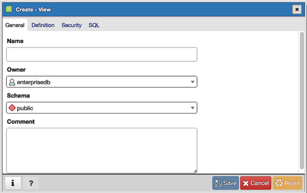
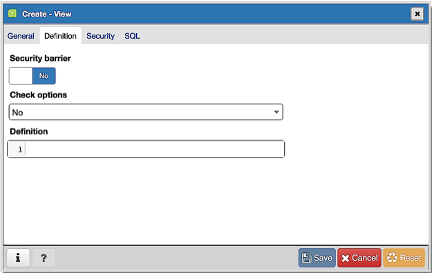
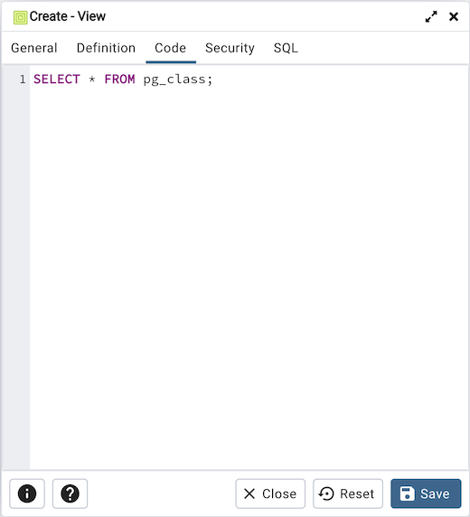
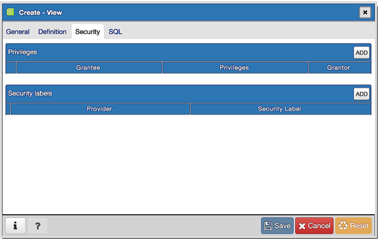
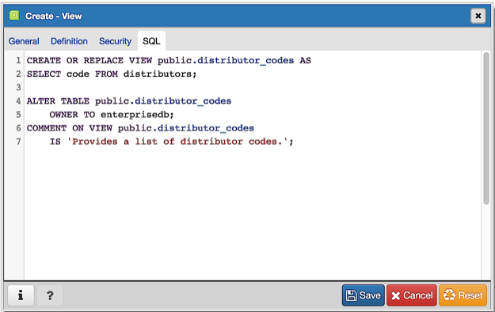

.. _view_dialog:

********************
`View Dialog`:index:
********************

Use the *View* dialog to define a view. The view is not physically materialized;
the query is executed each time the view is referenced in a query.

The *View* dialog organizes the development of a View through the following
dialog tabs: *General*, *Definition*, *Code* and *Security*". The *SQL* tab displays
the SQL code generated by dialog selections.

Click the *General* tab to begin.

Use the fields in the *General* tab to identify a view:

* Use the *Name* field to add a descriptive name for the view. The name of the
  view must be distinct from the name of any other view, table, sequence, index
  or foreign table in the same schema. The name will be displayed in the
  *pgAdmin* tree control.
* Use the drop-down listbox next to *Owner* to select the role that will own the
  view.
* If applicable, select the name of the schema in which the view will reside
  from the drop-down listbox in the *Schema* field.
* Store notes about the view in the *Comments* field.

Click the *Definition* tab to continue.

Use the fields in the *Definition* tab to define properties of the view:

* Set the *Security Barrier* switch to *Yes* to indicate that the view is to act
  as a security barrier.  For more information about defining and using a
  security barrier rule, see Section 38.5 of the PostgreSQL documentation.
* Use the drop-down listbox next to *Check options* to select from *No*, *Local*
  or *Cascaded*:

  * The *Local* option specifies that new rows are only checked against the
    conditions defined in the view. Any conditions defined on underlying base
    views are not checked (unless you specify the CHECK OPTION).
  * The *Cascaded* option specifies new rows are checked against the conditions
    of the view and all underlying base views.

Click the *Code* tab to continue.

Use the workspace in the *Code* tab to write a query to create a view.

Click the *Security* tab to continue.

Use the *Security* tab to assign privileges and define security labels.

Use the *Privileges* panel to assign privileges to a role. Click the *Add* icon
(+) to set privileges for the view:

* Select the name of the role that will be granted privileges from the drop-down
  listbox in the *Grantee* field.
* Click inside the *Privileges* field. Check the boxes to the left of one or
  more privileges to grant the selected privilege to the specified user.
* The current user, who is the default grantor for granting the privilege, is displayed in the *Grantor* field.

Click the *Add* icon (+) to assign additional privileges; to discard a
privilege, click the trash icon to the left of the row and confirm deletion in
the *Delete Row* popup.

Use the *Security Labels* panel to define security labels applied to the view.
Click the *Add* icon (+) to add each security label selection:

* Specify a security label provider in the *Provider* field. The named provider
  must be loaded and must consent to the proposed labeling operation.
* Specify a a security label in the *Security Label* field. The meaning of a
  given label is at the discretion of the label provider. PostgreSQL places no
  restrictions on whether or how a label provider must interpret security
  labels; it merely provides a mechanism for storing them.

Click the *Add* icon (+) to assign additional security labels; to discard a
security label, click the trash icon to the left of the row and confirm deletion
in the *Delete Row* popup.

Click the *SQL* tab to continue.

Your entries in the *View* dialog generate a SQL command (see an example below).
Use the *SQL* tab for review; revisit or switch tabs to make any changes to the
SQL command.

Example
*******

The following is an example of the sql command generated by user selections in
the *View* dialog:

The example shown demonstrates creating a view named *distributor_code*.

* Click the *Info* button (i) to access online help.
* Click the *Save* button to save work.
* Click the *Cancel* button to exit without saving work.
* Click the *Reset* button to restore configuration parameters.
