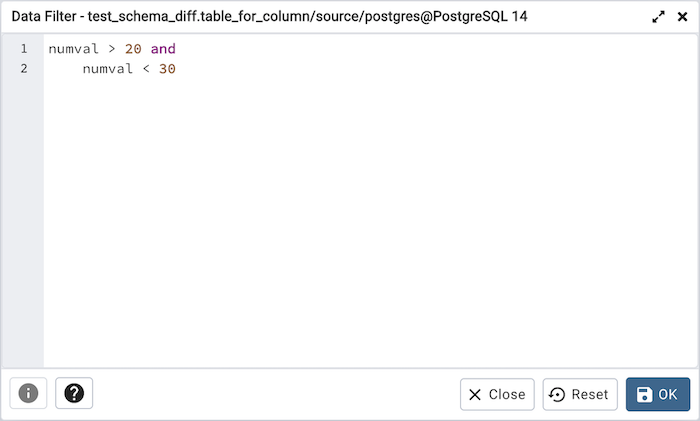

.. _viewdata_filter:

******************************
`View/Edit Data Filter`:index:
******************************

You can access *Data Filter dialog* by clicking on *Filtered Rows* toolbar button
visible on the Browser panel or by selecting *View/Edit Data -> Filtered Rows*
context menu option.

This allows you to specify an SQL Filter to limit the data displayed
in the edit grid window:

